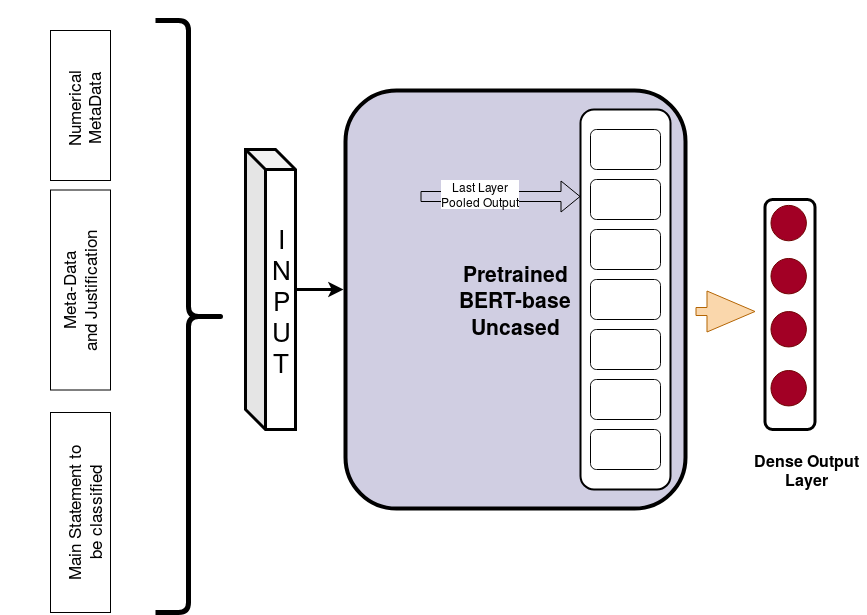
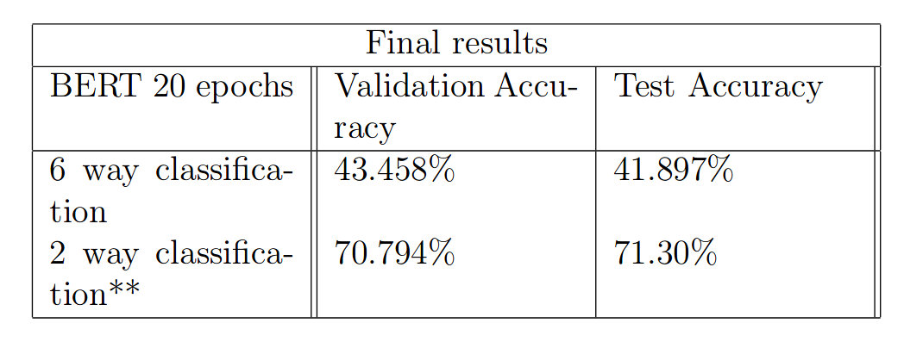

# Fake-News-Detection
[LIAR-PLUS](https://www.aclweb.org/anthology/W18-5513.pdf) is a benchmark dataset for fake news detection, released recently. This dataset has evidence sentences extracted automatically from the full-text verdict report written by journalists in Politifact.For truthfulness, the LIAR dataset has six labels: ***pants-fire, false, barelytrue***, **half-true, mostly-true, and true**.

The task was to achieve the highest possible accuracy on the LIAR-PLUS dataset classification.

## Model Design
The model uses BERT (Bidirectional Encoder Representations from Transformers) as the Encoder model for the Liar dataset inputs. 

  

The model I designed uses BERT pretrained model for encoded representations and those encoded representations are pooled and given to a dense layer to output class probabilities. The model was trained on only **6-way classification** and not on 2-way classification.**Cross entropy** is used as the loss function and hyperparameters are kept the same as used by BERT in other classsification tasks.

## Results

  

## Details and How to use
Refer to the [pdf report](Fake_News_Detection.pdf) attached for more details on the model, hardware requirements and how to use.

